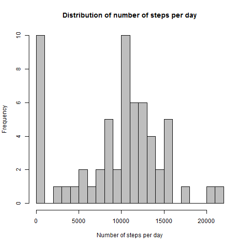
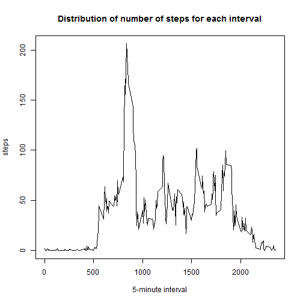
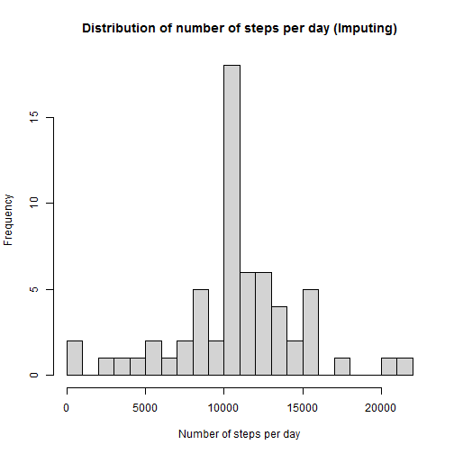
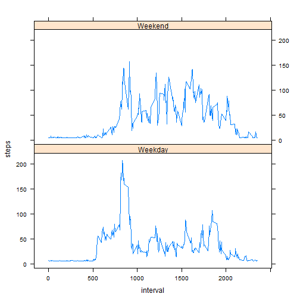

This a project for reproducible research.
===============================================


####**Loading and processing the data**

*Load the data using read.csv, and checking the data structure

```r
activity <- read.csv("./activity.csv", stringsAsFactors=FALSE)
str(activity)
```

```
## 'data.frame':	17568 obs. of  3 variables:
##  $ steps   : int  NA NA NA NA NA NA NA NA NA NA ...
##  $ date    : chr  "2012-10-01" "2012-10-01" "2012-10-01" "2012-10-01" ...
##  $ interval: int  0 5 10 15 20 25 30 35 40 45 ...
```

```r
head(activity)
```

```
##   steps       date interval
## 1    NA 2012-10-01        0
## 2    NA 2012-10-01        5
## 3    NA 2012-10-01       10
## 4    NA 2012-10-01       15
## 5    NA 2012-10-01       20
## 6    NA 2012-10-01       25
```


*transform the variable format in the data

```r
activity$date <- as.Date(activity$date) 
activity$steps <- as.numeric(activity$steps)
activity$interval <- as.numeric(activity$interval)
```


####**The mean total number of steps taken per day**

*Calculating the steps taken per day (ignoring the missing values)

1.Obtain the number of total steps for each day by aggregate the data by date

```r
df <- aggregate(activity$steps, by=list(activity$date), FUN=sum, na.rm=TRUE)
```
2.Plot histogram

```r
head(df)
```

```
##      Group.1     x
## 1 2012-10-01     0
## 2 2012-10-02   126
## 3 2012-10-03 11352
## 4 2012-10-04 12116
## 5 2012-10-05 13294
## 6 2012-10-06 15420
```

```r
colnames(df) <- c("date", "steps")
hist(df$steps,col="gray", breaks=30,
     main="Distribution of number of steps per day", xlab="Number of steps per day")
```

 

3. calculate the mean and median

```r
mean(df$steps)
```

```
## [1] 9354.23
```

```r
median(df$steps)
```

```
## [1] 10395
```


####**The average daily activity pattern**


*Time serial plot of the 5-minute interval and the average number of steps taken

1.Obtain the averaged number of steps for each interval

```r
aveint <- aggregate(activity$steps, by=list(activity$interval), FUN=mean, na.rm=TRUE)
```

2.Graph time serial plot of the 5-minutes interval

```r
colnames(aveint) <- c("interval", "steps")
plot(steps~interval, data=aveint, type="l",
     main="Distribution of number of steps for each interval",
     xlab="5-minute interval") 
```

 


*Calculate the 5-minute interval that contains the maximum number of steps

```r
subset(aveint,steps==max(steps))
```

```
##     interval    steps
## 104      835 206.1698
```


####**Imputing missing values**


*Calculate the total number of missing values in the dataset

```r
sum(is.na(activity))
```

```
## [1] 2304
```


*Fill the missing values with the average steps per 5-minute interval and create a new dataset. And then check the missing values again.

```r
repldata <- activity
repldata[is.na(repldata)] <- mean(aveint$steps)
sum(is.na(repldata))
```

```
## [1] 0
```


*Make a histogram of the total number of steps taken each day for the imputing data

```r
df1 <- aggregate(steps~date, repldata, FUN=sum, na.rm=TRUE)
hist(df1$steps,col="light gray", breaks=30,
     main="Distribution of number of steps per day (Imputing)", xlab="Number of steps per day")
```

 


*Calculate the mean and median total number of steps taken per day

```r
mean(df1$steps)
```

```
## [1] 10766.19
```

```r
median(df1$steps)
```

```
## [1] 10766.19
```

*After imputing the missing values, the values of the mean and median increased from 9354.23 and 10395, respectively. Therefore, the imputing result shits the distribution of the number of steps per day, which makes the values of mean and median at the same place.


####**Differences in activity patterns between weekdays and weekends?**


*Create a new factor variable in the imputed dataset with two levels - weekday and weekend


1.Change the class of date variable

```r
repldata$date <- as.Date(repldata$date)
```

2.Use weekdays to retrieve "day" and create a weekday data frame

```r
weekday<- as.data.frame(weekdays(repldata$date))

colnames(weekday) <- "day"
```

3.The following section needs the car package: install the car package and load it. Recode the weekday variable to "Weekday" and "Weekend"  

```r
library(car)
weekday$day <- recode(weekday$day,"c('Monday', 'Tuesday', 'Wednesday', 'Thursday', 'Friday')='Weekday'") 
weekday$day <- recode(weekday$day,"c('Sunday', 'Saturday')='Weekend'")
```

4.COmbine the weekday data frame to the previously imputed dataset

```r
combweek <- cbind(weekday, repldata)

head(combweek) 
```

```
##       day   steps       date interval
## 1 Weekday 37.3826 2012-10-01        0
## 2 Weekday 37.3826 2012-10-01        5
## 3 Weekday 37.3826 2012-10-01       10
## 4 Weekday 37.3826 2012-10-01       15
## 5 Weekday 37.3826 2012-10-01       20
## 6 Weekday 37.3826 2012-10-01       25
```

```r
str(combweek)
```

```
## 'data.frame':	17568 obs. of  4 variables:
##  $ day     : Factor w/ 2 levels "Weekday","Weekend": 1 1 1 1 1 1 1 1 1 1 ...
##  $ steps   : num  37.4 37.4 37.4 37.4 37.4 ...
##  $ date    : Date, format: "2012-10-01" "2012-10-01" ...
##  $ interval: num  0 5 10 15 20 25 30 35 40 45 ...
```


*obtain the averaged number of steps for each interval

```r
aveintw <- aggregate(combweek$steps, by=list(combweek$interval, combweek$day), FUN=mean, na.rm=TRUE)
colnames(aveintw) <- c("interval", "day", "steps")
```


*Graph the new time serial plot of the 5-minutes interval

```r
library(lattice)
xyplot(steps ~ interval | factor(day), layout = c(1, 2), data=aveintw, type='l')
```

 
